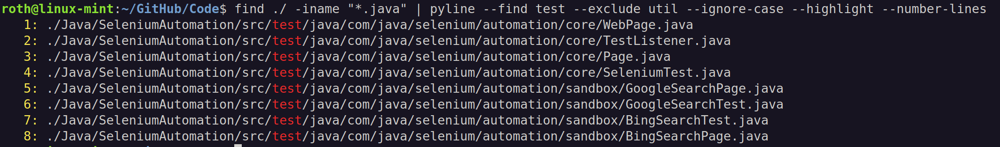
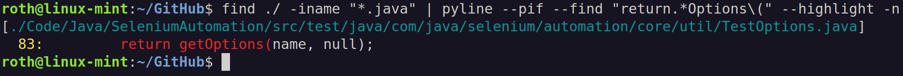

## pyline: A Python line processor

**Version:** 1.10.8

### Overview

**pyline** is a simple line processor written in Python. There is nothing **pyline** can do that you can't already do
with `cat`, `grep` and `sed`. **pyline** however, provides a simple interface to finding and editing lines from `stdin`
or from files. **pyline** does not modify the contents of files. It only prints to `stdout` which can be piped to other
commands. **pyline** started out as a simple script to deal with whitespace in file paths from a `find` command in
order to pipe them to `xargs`. From there it grew into a script to perform a variety of functions to lines. The
following document describes its usage.

### Table of Contents

1. [Installation](#Installation)
2. [Whitespace](#Whitespace)
3. [Searching & Filtering](#Searching--Filtering)
4. [PIF](#PIF)
5. [Editing](#Editing)
6. [Misc. Options](#Misc-Options)
7. [Help Output](#Help-Output)
8. [Undocumented Features](#Undocumented-Features)

### Installation

To use **pyline**, download `pyline.py` to a folder in your `PATH` and set the executable flag. Optionally, you can
rename the file to just `pyline` to simplify using it, as it is used in this document. To run pyline, simply run it with
options or use it in a pipe. **pyline** requires `python3` but it can be executed on its own without manually invoking
the interpreter.

### Whitespace

**pyline** can escape, trim or wrap lines to deal with whitespace. This is important when piping output to other
commands that process files. The following examples demonstrate these options, which work the same whether the input is
piped from another command or from a file.

**Examples:**

Escape whitespace:

```bash
find ./ -iname "*.txt" | pyline -e
```

Wrap in double quotes:

```bash
find ./ -iname "*.txt" | pyline -w \" \"
```

Wrap in single quotes:

```bash
find ./ -iname "*files*" | pyline -w \' \'
```

Trim leading whitespace:

```bash
pyline [file] -l
```

Trim trailing whitespace:

```bash
pyline [file] -t
```

### Searching & Filtering

There are four options for searching for patterns in lines; `--find`, `--find-all`, `--exclude` and `--exclude-all`.
Each option takes an arbitrary list of patterns. `--find` and `--exclude` act like an `or` operator whereas `--find-all`
and `--exclude-all` act like an `and` operator. Additional options are `--ignore-case`, which performs case-insensitive
pattern matching, and `--highlight`, which adds a highlight color to a find match when printed. **pyline** supports
regex patterns, but to avoid being interpreted by the shell, wrap the patterns in quotes.

**Examples:**

Find all files that end in ".java" and display the files that contain trailing whitespace:

```bash
find ./ -iname "*.java" | pyline --pif -f "\s+$"
```

Find all files that end in ".java" and display file names that contain "api" or "util":

```bash
find ./ -iname "*.java" | pyline -f api util
```

Find all files that end in ".java" and display file names that contain "api" and "test" regardless of case and highlight
the
patterns:

```bash
find ./ -iname "*.java" | pyline -F api test -Hi
```

Find all files that end in ".java" and display file names that do not contain "api" and "util" regardless of case:

```bash
find ./ -iname "*.java" | pyline -X api util -i
```

Find all files that end in ".java" and display file names that contain "test" but exclude files that contain "util"
regardless of case. Highlight the patterns and number the lines in the output:

```bash
find ./ -iname "*.java" | pyline -f test -x util -Hio
```



Find all files that end in ".java" and display files that contain the pattern `return.*Options(`. Highlight the patterns
and show their line numbers:

```bash
find ./ -iname "*.java" | pyline --pif -f "return.*Options\(" -Hn
```



### PIF

`--pif` tells **pyline** that the piped input is files. **pyline** will apply the options to the contents of the files
rather than the file names. If a pattern is found using `--pif`, the name of the file will be displayed in a header.
`--name-only` tells **pyline** to display just the file name if a find or exclude pattern is found. This is useful for
deleting files that contain or don't contain a pattern.

**Examples:**

Find all files that end in ".java" and display the lines from the files that contain the text "util":

```bash
find ./ -iname "*.java" | pyline -f util --pif
```

Find all files that end in ".java" and display the file names for files that contain the text "util":

```bash
find ./ -iname "*.java" | pyline -f util --pif --name-only
```

Find all files that end in ".java" and display the file names for files that do not contain the text "util":

```bash
find ./ -iname "*.java" | pyline -x util --pif --name-only
```

### Editing

Work in progress...

### Misc. Options

Work in progress...

### Help Output

```bash
pyline -h
```

```
usage: pyline [-h] [-a] [-b] [-e] [-l] [-n | -o] [-q] [-s] [-t] [-v] [-w ^ $] [--change-tabs n] [-T] [--pif] [--iso] [-N]
              [-f pattern [pattern ...] | -F pattern [pattern ...]] [-x pattern [pattern ...] | -X pattern [pattern ...]]
              [-r pattern replace] [-y pattern [pattern ...]] [-H] [-i] [-c | -S] [files ...]

utility for processing lines of input.

positional arguments:
  files                                 files to process lines from

options:
  -h, --help                                show this help message and exit
  -a, --add-newline                         add a newline after processing
  -b, --ignore-blank                        ignore blank lines
  -e, --escape                              escape\ white\ space
  -l, --trim-leading                        trim leading whitespace
  -n, --line-numbers                        show line numbers
  -o, --number-output                       number output lines
  -q, --quiet                               no file name headers or error messages
  -s, --squeeze-blank                       suppress repeated blank lines
  -t, --trim-trailing                       trim trailing whitespace
  -v, --version                             show program's version number and exit
  -w ^ $, --wrap ^ $                        ^wrap lines between tokens$
  --change-tabs n                           change tabs to 'n' spaces
  -T, --show-tabs                           show tabs as >··
  --pif                                     treat piped input as file names
  --iso                                     if --pif, use iso-8859-1 for encoding instead of utf-8
  -N, --name                                if --pif, show just the file name for find or exclude patterns

search options:
  -f, --find pattern [pattern ...]          find lines that contain any pattern
  -F, --find-all pattern [pattern ...]      find lines that contain all patterns
  -x, --exclude pattern [pattern ...]       exclude lines that contain any pattern
  -X, --exclude-all pattern [pattern ...]   exclude lines that contain all patterns
  -r, --replace pattern replace             replace any pattern
  -y, --yank pattern [pattern ...]          yank any pattern from lines
  -H, --highlight                           highlight matches in lines
  -i, --ignore-case                         ignore case when pattern matching
  -c, --count                               show just the count for find patterns
  -S, --sum                                 show just the sum for find patterns

files after a find, exclude or yank will be treated as patterns
```

### Undocumented Features

Work in progress...
